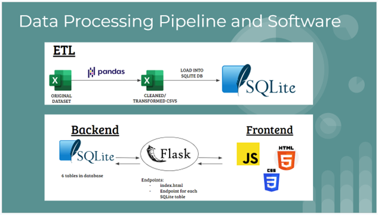

# Project 3: FDIC Failed Banks Analysis
<!-- 

 -->

    
    
    

 

# Group 8 Members
<li> Grace Yoo </li>
<li> Kiana Navarre </li>
<li> Pooja Rajasekharan </li>
<li> Ry Avery </li>
<li> Nicole Bustamante </li>
 

# Dashboard
<a href=""> FDIC Failed Banks Dashboard (Under Construction) </a>
 
 

# Topic: US Bank Failures

### <b>Motivation:</b> 
To investigate bank failures within the United States from 2000 to 2022 to try and understand the impact to personal finances as well as to our overall economy.

### <b>Target Audience:</b>
The general public for educational purposes.

### <b>Value Proposition:</b>
To gain an understanding of how outside factors (Covid, Sub-Prime Mortgage Crisis, etc.) impact bank health to better guide personal financial decisions.

### <b>The Datasets</b>
Raw data retrieved from the FDIC:
<li><a href="https://www.fdic.gov/resources/resolutions/bank-failures/failed-bank-list/index.html"> "banklist" </a></li>
<li><a href="https://banks.data.fdic.gov/explore/failures?aggReport=detail&displayFields=NAME%2CCERT%2CFIN%2CCITYST%2CFAILDATE%2CSAVR%2CRESTYPE%2CCOST%2CRESTYPE1%2CCHCLASS1%2CQBFDEP%2CQBFASSET&endFailYear=2023&sortField=FAILDATE&sortOrder=desc&startFailYear=2012"> "bankdata" </a></li>
<li><a href="https://receivership.fdic.gov/drripbal/"> "balancesheetsummaries" </a></li>
 

Scrubbed data:
<li><a href="https://github.com/geyo/Project-3/blob/main/static/data/balance_sheets_for_database.csv"> "balancesheetsfordatabase" </a></li>
<li><a href="https://github.com/geyo/Project-3/blob/main/static/data/banklist_for_dropdowndemo.csv"> "banklistfordropdowndemo" </a></li>
<li><a href="https://github.com/geyo/Project-3/blob/main/static/data/updated_banks_with_coordinates_qbfasset.csv"> "bankswithcoordinates" </a></li>
<li><a href="https://github.com/geyo/Project-3/blob/main/static/data/trendchart.csv"> "trendchart" </a></li>
 

# Outputs
The following visualizations can be found and further explored by visiting the dashboard referenced above:
<li> Interactive Map - <i>markers indicate location and size of bank failure </i></li>
<li> Historical Trend Analysis - <i>dropdown menu by year </i></li>
<li> Bank Demographics - <i>dropdown menu by bank </i></li>
<li> Pie Chart <i>breakdown of total liabilities </i></li>
<li> Data Definitions - <i>table defining common terms </i></li>
 

# Methodology
Data Processing Pipeline, Software, ETL:

 

# Resources
### Data Sources:
<i>Please see "Datasets" above</i>
### Software/Tools:
Excel, Jupyter, Python, Pandas, API, SQLite, Flask, JavaScript, VSCode, HTML, CSS, Chrome DevTool